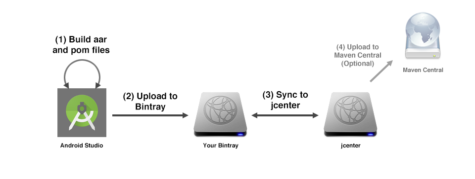
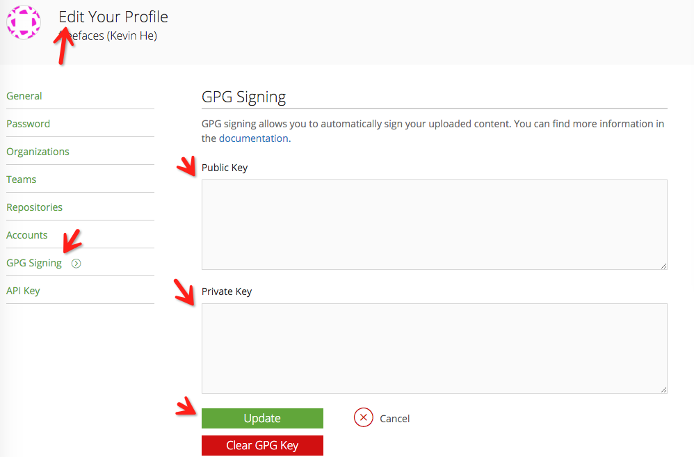
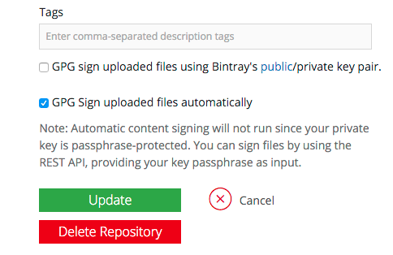
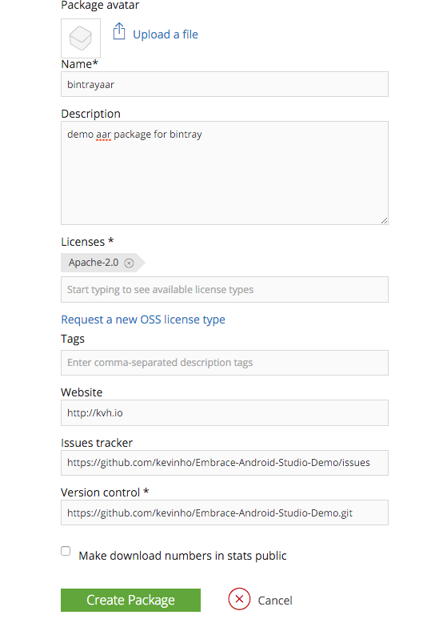
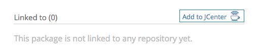
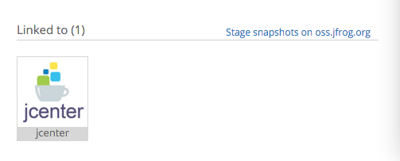
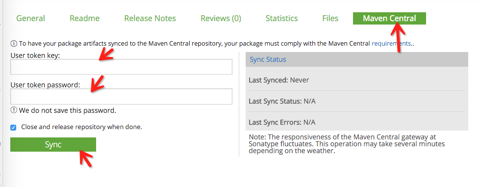

# MavenDeployDemo

利用Android Studio发布包aar/jar到bintray jcenter远程仓库中的笔记

参考[blog.bugtags.com](http://blog.bugtags.com/2016/01/27/embrace-android-studio-maven-deploy/) 文档

参考[demo例子](https://github.com/kevinho/Embrace-Android-Studio-Demo/tree/master/S4-MavenDeploy)

# Maven包（Package）

至于 Maven 是什么，请参考 [Apache Maven](https://zh.wikipedia.org/wiki/Apache_Maven)。

对于 Android 开发者而言，只需要知道 Maven 是一种构建工具，Maven 包是由所谓 POM（Project Object Model）所定义的文件包格式即可。

Gradle 可以使用 Maven 包，而且大部分的 Android 能够使用的远程依赖包都是 Maven 包。

先来看一个托管在某仓库上的 Maven 包：bintrayaar 所包含的内容：

	bintrayaar-1.0.0-javadoc.jar		//javadoc 文件
	bintrayaar-1.0.0-javadoc.jar.asc		//javadoc 文件的签名
	bintrayaar-1.0.0-sources.jar		//源码文件
	bintrayaar-1.0.0-sources.jar.asc		//源码文件的签名
	bintrayaar-1.0.0.aar		//Android Library 的主文件包
	bintrayaar-1.0.0.aar.asc		//主文件包的签名
	bintrayaar-1.0.0.pom		//包描述文件
	bintrayaar-1.0.0.pom.asc		//描述文件的签名

对于一个合符规范的 Maven Package，pom 文件、aar（或者 jar） 文件是必须的。

而 javadoc 文件、源码文件、签名文件都不是必要的，但是某些公开仓库（如 mavenCentral ）有此要求。

使用这个包的方式，相信大家已经很熟悉了：

	dependencies {
   		compile 'com.huyunit.as-gradle.demo:bintrayaar:1.0.0'
	}
	

# POM 文件

一个 Maven Package，最重要就是 POM（Project Object Model） 文件，这其实是一个 XML 文件，这里截取 bintrayaar POM 主要内容如下：

	<?xml version="1.0" encoding="UTF-8"?>
	<project xsi:schemaLocation="http://maven.apache.org/POM/4.0.0 http://maven.apache.org/xsd/maven-4.0.0.xsd" xmlns="http://maven.apache.org/POM/4.0.0"
    xmlns:xsi="http://www.w3.org/2001/XMLSchema-instance">
  		<modelVersion>4.0.0</modelVersion>
  		<groupId>com.huyunit.as-gradle.demo</groupId>
  		<artifactId>bintrayaar</artifactId>
  		<version>1.0.0</version>
  		<packaging>aar</packaging>
  		<dependencies>
    		<dependency>
      			<groupId>com.android.support</groupId>
      			<artifactId>support-v4</artifactId>
      			<version>19.0.0</version>
      			<scope>compile</scope>
    		</dependency>
  		</dependencies>
	</project>

- modelVersion: 从 mvn 2.x 起，这个数值都是4.0.0
- packaging：打包方式，aar 是 Android Libirary 的打包方式，常用的还有 jar
- dependency：声明依赖列表

- 包的唯一标示：

<!---->
	<!--包组 id，通常是发布者拥有的域名的反向，以免跟别人的重复-->
	<groupId>com.huyunit.as-gradle.demo</groupId>
	<!--包 artifactId，不好意思我也不知道如何准确翻译，其实就是组以下应该有一个更小的归类-->
	<artifactId>bintrayaar</artifactId>
	<!--包版本-->
	<version>1.0.0</versio>

其中三个字段与 Gradle 的依赖格式 'com.huyunit.as-gradle.demo:bintrayaar:1.0.0' 冒号分割的三段一一对应。这就解释了所谓的 Gradle 兼容 Maven 包。

# Maven 仓库

Maven 包集中存放的地方，就是 Maven 仓库。这些仓库，可以是放在本地，也可以放在某个远程服务器上。 可以是私有仓库，也可以是公开的。下面是笔者日常开发用的库列表：

	repositories {
        jcenter()
        mavenCentral()
        maven {
            url "http://maven.justonetech.com:9090/nexus/content/groups/public"
			credentials {
				//鉴权用户
                username 'jiangqingbo'
                password '123456'
            }
        }
    }

Android Studio Gradle 主要支持两个 Maven 中央库：mavenCentral 和 jcenter。

- mavenCentral 是最早的 maven 中央仓库
- jcenter 是 Android Studio 0.8 版本起的默认 maven 中央仓库
- 第三个是笔者的本机的仓库
- 第四个是笔者部署在内网服务器的私有仓库

读者可能会发现两个问题：

- 为什么有了 mavenCentral，谷歌还切换到了 jcenter？
- maven { url : xxx}，这种格式可以配置任何一个存在的仓库？

解析如下：

## jcenter VS. mavenCentral

- jcenter 是一个 mavenCentral 的超集，jcenter 还包含了其他 maven 包
- jcenter 具有更好的 cdn，默认支持 https，这个对于谷歌有巨大吸引力
- bintray（jcenter 的服务提供商）表示 jcenter 具有更好的性能
- 有数据表明 bintray jcenter 占用更少的本地缓存空间
- 更好的交互界面，可以从 jcenter 向 mavenCentral 同步包（下面两个平台的使用教程将会证实这一点）

>  笔者亲测，在 bintray 上发布包到 jcenter 在易用性上的确比 在 sonatype 发布到到 mavenCentral 要好得多。

## 使用符合规范的 maven 仓库

没错，你可以通过 maven { url : xxx }使用任何一个符合 maven 规范的仓库。

#### 1、存在本地的

	maven {
	    url 'file:///Users/my-user-name/Documents/Android/repo/'
	}

#### 2、存在内网服务器的

	maven {
	    url 'http://192.168.99.100:8081/content/repositories/releases/'
	}

#### 3、存在某个远程服务器的

	maven {
	   	url 'http://maven.justonetech.com:9090/nexus/content/groups/public'
	}

> 此仓库由 liaohuqiu 同学为方便大家使用友盟开发者工具，把相应的包做成了符合规范的 Maven 包，托管在 github 项目中。

# 发布 Maven 包

使用 maven 包相信已经很清楚了，让我们更进一步。

当我们在日常开发实践中，积累了一些公共库，想要固定下来，被自己或者别人方便的使用，就需要发布 maven 包。

一个符合规范的 maven 包至少包含 pom 文件和主文件包。难道这些都要手动编写和创建么？

答案是：有了 gradle 插件，你只需要干很少的事儿。

# 全局设定

下面以发布这系列包为示例：

- groupId: com.huyunit.as-gradle.demo //改成你的 groupId
- artifcatId: bintrayaar //artifactId 会有些变化。
- version: 1.0.0

也就是'com.as-gradle.demo:x:1.0.0'

> 读者要进行练习的时候，最好改一下你的 groupId，否则可能会发布失败

下面使用到的示例工程已经放在了 [github](https://github.com/jiangqingbo/MavenDeployDemo.git)上。

为了后面使用方便，首先在工程的项目 gradle.properties 中定义一些属性，这些属性，主要是用生成 POM 文件，将会在通篇文章中用到：

	# 包信息
	PROJ_GROUP=com.huyunit.as-gradle.demo

	PROJ_VERSION=1.0.0
	PROJ_VERSION_CODE=1

	# 项目的描述
	PROJ_WEBSITEURL=https://github.com/jiangqingbo
	PROJ_ISSUETRACKERURL=https://github.com/jiangqingbo/MavenDeployDemo/issues
	PROJ_VCSURL=https://github.com/jiangqingbo/MavenDeployDemo.git
	PROJ_DESCRIPTION=demo apps for embracing android studio

	# Licence信息
	PROJ_LICENCE_NAME=The Apache Software License, Version 2.0
	PROJ_LICENCE_URL=http://www.apache.org/licenses/LICENSE-2.0.txt
	PROJ_LICENCE_DEST=repo testing

	# Developer 信息
	DEVELOPER_ID=your-dev-id
	DEVELOPER_NAME=your-dev-name
	DEVELOPER_EMAIL=your-email@your-mailbox.com

# 发布包到本地仓库

###### 1、创建一个 module：localrepo

###### 2、将本地某个路径设置为仓库根目录：
	
		
	file://D:/libs/repository (windows平台， 请自行更换)

###### 3、为了优雅，在 localrepo 这个 module 的 gradle.properties 定义属性：

	PROJ_NAME=localrepodemo
	PROJ_ARTIFACTID=localrepodemo
	PROJ_POM_NAME=Local Repository

	LOCAL_REPO_URL=file://D:/libs/repository

###### 4、在 module 中应用和配置 maven plugin：

	apply plugin: 'maven'

	uploadArchives {
    	repositories.mavenDeployer {
        	repository(url: LOCAL_REPO_URL)
        	pom.groupId = PROJ_GROUP
        	pom.artifactId = PROJ_ARTIFACTID
        	pom.version = PROJ_VERSION
    	}
	}

###### 5、在控制台运行：

	D:\x\x\MavenDeployDemo> gradlew.bat -p localrepo clean build uploadArchives --info

###### 6、一切顺利的话，你的第一个本地包已经发布到设定的目录的本地仓库了

# 使用本地包（两个疑问向读者请教）

###### 1、要使用这个包，首先在项目的 build.gradle 中添加这个本地仓库：

	allprojects {
   		repositories {
       		jcenter()

       		maven{
           		url 'file://D:/libs/repository'
       		}
   		}
	}

###### 2、在某个 module（如 demo 项目中的 app） 的 build.gradle 中添加依赖：

	compile 'com.huyunit.as-gradle.demo:localrepodemo:1.0.0'

# 发布包到 Bintray jcenter 远程仓库

## 简介

jcenter 是由 [bintray](https://bintray.com/) 提供的 maven 中央库托管服务，bintray 又是 [jfrog](https://www.jfrog.com/) 公司的一款产品。jfrog 是一个商业公司，通过提供高级服务盈利，又为普通开发者提供了足够用的免费基础功能（截止至2016-01-24），笔者较为推崇这种开发者服务的商业模式。

> 引用一张图来表述 bintray 的工作方式

图片来源，[http://inthecheesefactory.com/](http://inthecheesefactory.com/)

使用 jcenter 需要在 bintray 上注册账号，在本地进行加密签名配置，下面开始介绍。

## 1. 注册账号

- 登陆 jcenter [首页](https://bintray.com/)
- sigin -> signup，填写表单，注意 username 这一栏是后面的 bintray 私有库的后缀，要慎重选择。

## 2. 创建 GPG 签名

> 前方高能预警：比较繁琐，切勿半途放弃

前面介绍过，可以把 bintray 的包同步到 mavenCentral，而后者需要对包文件进行[签名](http://blog.sonatype.com/2010/01/how-to-generate-pgp-signatures-with-maven/#.VqTRiFN94n0)，签名和验证过程需要用到一个叫做 [GPG](https://www.gnupg.org/) 的工具产生的公钥和私钥。这里有适合[多个平台](https://www.gnupg.org/download/index.html)的 GPG 程序，下面只介绍 OSX 平台。

> 这种工具大概的意义是产生公钥和私钥，把公钥发送到公开的服务器，私钥用来产生包文件签名。包的使用者在拿到包文件之后，通过公钥来验证文件的有效性，运行具体原理参考[这里](https://www.gnupg.org/gph/en/manual/x135.html)。

###### 1、下载 [gpgtool](http://gpgtools.org/)，安装
###### 2、 检测安装成功，在命令行运行

	C:\Users\think>gpg --version
	gpg (GnuPG) 2.1.15
	libgcrypt 1.7.3
有类似的输出，就是正常安装了

###### 3、产生证书，运行命令，按照提示输入

	> gpg --gen-key

###### 4、检查结果

	> gpg --list-keys

###### 5、找到刚才创建证书的时候，输入的相关信息那三行，例如：

	pub   2048R/28A60488 2016-09-18 
	uid       [ultimate] jiangqingbo <jqbo84@163.com>
	sub   2048R/0DF90082 2016-09-18

###### 6、上传公钥到服务器，找到你的 pub 的那一行，2048R/后的那一串八位字符串，如上面的：2E686B39，就是公钥 ID
	
	> gpg --keyserver hkp://pool.sks-keyservers.net --send-keys your-public-key-id

###### 7、输出公钥和私钥成文件

	> gpg -a --export your-email@your-mailbox.com > public_key_sender.asc
	> gpg -a --export-secret-key your-email@your-mailbox.com > private_key_sender.asc

###### 8、配置本地 gradle 运行环境的属性，位于~/.gradle/gradle.properties，添加内容：

	signing.keyId=your-public-key-id
	signing.password=your-gpg-password
	signing.secretKeyRingFile=/Users/your-user-name/.gnupg/secring.gpg

###### 9、bintray 本身可以通过在 profile->GPG Sining 中配置 public key 和 private key 来自动对上传的文件进行签名，在下图中，对应填入 public_key_sender.asc 与 private_key_sender.asc 的内容即可

###### 10、设置 bintray maven 包自动签名
选取 maven 仓库首页，进入 edit：

最下面有两个选项：

	GPG sign uploaded files using Bintray's public/private key pair.
	GPG Sign uploaded files automatically

因为咱们是希望使用自己的 key，所以勾选第二个。

## 3. 创建 bintray 项目

首页-> maven -> add new package，填入对应的信息，其中 name 是在下面 bintray gradle 插件上传的时候，使用的项目名称，例如：bintryaar，这是要上传一个 Android Library，上传纯 Java 包的方式有点点不一样，下面有介绍。

## 4. 配置插件

bintray 官方在 github 上托管了 [bintray-examples](https://github.com/bintray/bintray-examples)，方便用户使用 gradle 上传包。

因为这里要上传的是 aar 格式的包，所以，具体是参考 [gradle-aar-example](https://github.com/bintray/bintray-examples/tree/master/gradle-aar-example) 例子，然而例子有一些地方没有更新，请注意下面的描述。

###### 1、在项目中创建 local.properties 来配置 bintray 登陆信息以及 gpg 证书密码

	bintray.user=your-bintray-user
	bintray.apikey=your-bintray-apikey
	bintray.gpg.password=your-gpg-password

其中 your-bintray-user 就是 bintray 右上角显示的用户名称，your-bintray-apikey 在 profile->API Key 可以找到，your-gpg-password 则是创建 gpg 证书的时候的密码

###### 2、在项目的 build.gradle 配置 buildscript 的 classpath

	buildscript {
    	repositories {
        	jcenter()
    	}
    	dependencies {
        	classpath 'com.android.tools.build:gradle:1.3.0'
        	//下面两个包是用于上传的插件
        	classpath 'com.jfrog.bintray.gradle:gradle-bintray-plugin:1.0'
        	classpath 'com.github.dcendents:android-maven-gradle-plugin:1.3'//注意此处
    	}
	}

###### 3、在 module 的 gradle.properties 文件中定义属性

	PROJ_NAME=bintrayaar
	PROJ_ARTIFACTID=bintrayaar
	PROJ_POM_NAME=Bintray Aar Repository

###### 4、在 module 的 build.gradle 中使用插件

	apply plugin: 'com.github.dcendents.android-maven'
	apply plugin: 'com.jfrog.bintray'

###### 5、为了build.gradle 文件干净，笔者创建了一个名为 bintray.gradle 的文件配置插件信息，请参考[这个文件](https://github.com/jiangqingbo/MavenDeployDemo/blob/master/bintrayaar/bintray.gradle)。
关键点：

	artifacts {
    	archives javadocJar
    	archives sourcesJar
	}

是为了同时生成 javadoc.jar 和 sources.jar 文件

###### 6、build，上传

	> gradlew.bat -p bintrayaar/ clean build bintrayUpload --info

如果一切顺利，你会在控制台看到多个文件上传成功的标输出

## 踩坑实录

- HTTP/1.1 401 Unauthorized

- apikey 或者 user 填写错误

- HTTP/1.1 409 Conflict

包的该版本已经存在，需要在 bintray 管理界面上删除该版本后才可以再次上传

- 想让 sources.jar 或者 javadoc.jar 为空

	task sourcesJar(type: Jar) {
			classifier = 'sources'
    		from sourceSets.main.java.srcDirs
    		exclude '**'
	}
	
- gradlew: command not found

解决方法1：使用 ./ 指定当前目录，如： ./gradlew bintrayUpload
	
解决方法2：配置全局环境变量

   a）找到gradle文件所在路径。该文件可在Android Studio安装目录下找到，如：/Applications/Android Studio.app/Contents/gradle/gradle-2.14.1/bin
   b）配置.bash_profile文件。如：
   	
	export PATH=${PATH}:/Applications/Android\ Studio.app/Contents/gradle/gradle-2.14.1/bin
	
   注意AndroidStudio单词间的 \ + 空格。
   c）使.bash_profile文件立刻生效。在终端执行：source .bash_profile

- Could not sign version '1.0.0': HTTP/1.1 400 Bad Request [message:Private key is required, please supply it by using a JSON body or alternatively it can be stored in your Bintray profile]

出现这个错误，说明使用到了private key, 所以要将私钥key导出来，执行 创建GPG签名到步骤7 的操作：
	
	> gpg -a --export-secret-key your-email@your-mailbox.com > private_key_sender.asc

然后将私钥文件内容拷贝并粘贴到bintray.com编辑信息里到GPG Signing栏目中的private key框里，然后点击Update，最后在执行上传library操作即可成功。

## 5. 上传 Jar 包

###### 1、在上传 jar 的时候，使用的插件有些区别

	apply plugin: 'maven-publish'
	apply plugin: 'com.jfrog.bintray'

###### 2、在生成符合规定的 pom 文件的时候，要调用 groovy 的API，具体请参考[这个文件](https://github.com/jiangqingbo/MavenDeployDemo/blob/master/bintrayjar/bintray.gradle)

## 6. 通过私有仓库的方式引用

至此，刚才上传的两个库，已经可以通过如下方式引用了

	allprojects {
    	repositories {
            maven {
            	url 'https://dl.bintray.com/freefaces/maven'//这个地址在包的页面的右方
        	}
    	}
	}

	compile 'com.as-gradle.demo:bintrayaar:1.0.0'
	compile 'com.as-gradle.demo:bintrayjar:1.0.0'

但是你也发现了，包的用户需要添加一个额外的 maven 仓库。作为一个以用户价值为先的库的开发者，那当然不希望用户麻烦的。那就需要把这个私有的库，推送到 jcenter 上去。

## 7. 推送到 jcenter

在 bintray 的 maven 库的界面，有 add to jcenter

点击之后，会进入一个消息页面，写或者不写都可以。提交，等待回复即可。

记住,包必须满足如下条件：

- 包含 sources.jar 和 javadoc.jar 文件
- 必须是 maven 包

> bintray 的消息系统有些 bug，假设你的包提交申请被驳回，你修改之后再提交申请，可能没有人回复你。请不要傻等。直接找页面右侧的 Feedback，这个他们是很快有人回答的。

成功了之后，会出现如下的标记：

你可以在 jcenter [服务器](http://jcenter.bintray.com/)上看到你的包了

## 8. 推送到 mavenCentral

在包管理页面，可以找到推送到 mavenCentral 功能，

#### 一个包要从 bintray 推送到 jcenter，有几个前提：

- 已经推送到了 jcenter[已完成]
- 每个文件都有对应的签名[已完成]
- 有 sonatye 账户[未完成]
- maven 仓库经过审核[未完成]

点击 Sync 之后，一段时间之后，右边的 Sync Status 会反馈出结果。

当然了，现在咱还干不了这个，因为还有两个条件没准备好。那咱们就进入 mavenCentral 的条件准备。

# 发布包到 Sonatype MavenCentral 远程仓库

## 1. 注册 sonatye 账户

### 进入 sonatype issue 页面，注册账号。

# 后续完善。

